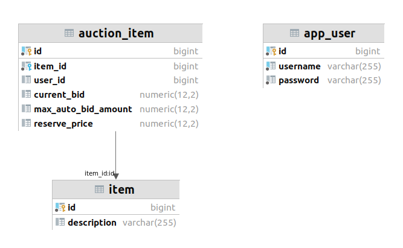
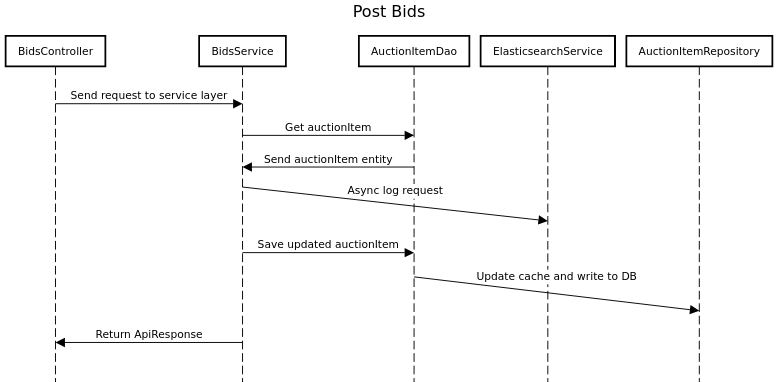

# README

## Build and run

`./build-and-run.sh`

Access web app by going to http://localhost:4200/

Log in as either `John Lennon`, `Paul McCartney`, `George Harrison`, or
`Ringo Starr`. Password for all of them is `password`.

Run `./shutdown-containers.sh` to close any containers which did not close
properly.

## Requirements

* *Uses one or more databases for persistence; Any database(s) can be used; for simplicity an in-memory database such
  as H2 or a modern NoSQL engine is acceptable. Be prepared to explain your persistence choice(s) and describe how
  you architected the data tier for scale.*

Data such as users, items, and auction items relate to each other and can
nicely be expressed in a tabular format, therefore it will be stored in a
relational database. I am most familiar with Postgres so this was my choice.
Audit logging of the bid data is persisted in Elasticsearch. Further
explanation for this choice may be found below.

* *Testing (Unit, Functional, Integration, Automated, and Performance)* 

Unit and Integration tests are written with Spring Boot. They both will run
when maven builds the project. Integration tests have `IT` appended to their 
class name to distinguish them from unit tests. There are maven plugins 
available to specify which type of tests should run. This leave us the
option of disabling integration tests but keeping unit tests enabled for
quicker builds.

Integration tests leverage `Testcontainers` to test routines that interact
with Postgres and Elasticsearch.

* *Code quality and structure*

Overall I try to follow **S.O.L.I.D.** design principles. The service layer
makes heavy use of interfaces to decrease coupling against concrete
implementations, and the amount of public methods exposed by classes are
limited. *Clean code* concepts such as organizing methods into different
levels of abstraction are followed to improve readability. The **D.R.Y.** design
principle is followed by placing resuable code in separate methods instead
of duplicating it.

The **DTO** design pattern is heavily used to prevent heavy coupling between
the web and data layers. The **DAO** pattern is used to mediate between
the service and data layers and decide if requests should go to the cache
or to the database.

* *Scalability (can your solution easily scale to millions of 
transactions per day?)*

Caching has been implemented to minimize direct access to Postgres with 
Spring Cache. It uses a naive `ConcurrentHashMap` by default, but can be
easily figured to use a more advanced solution such as Redis. If such a
distributed cache provider is chosen then there is no reason why this Auction
app cannot be scaled horizontally as web traffic increases.

Postgres is easy to scale horizontally for reads with read replicas, but
difficult to scale horizontally for writes. The best solution would be to
shard the `auction_item` table by `id`, since this table receives the most
writes.

* *Extensibility (how would you add additional endpoints?)*

So far the API is RESTful and implements a few of the standard **C.R.U.D**
operations. The Spring Boot controllers build for these endpoints handle
a single HTTP method. Some HTTP methods are not implemented yet, such as 
**delete**, so for example the same endpoint url could be used for this 
which accepts HTTP **DELETE** requests.

* *Modern practices*

I'm not sure what is meant by this. I followed a TDD approach and loosely
followed a Git Flow approach for branching.

* *Cloud/Container friendly (deployment and DevOps pipeline are some examples)*

The application is Dockerized and can be built with the 
`build-and-run.sh` script. Due to time constraints, no pipeline has been
set up, but it could be. A pipeline which builds the project with maven
will automatically run all the unit and integration tests. As long as the
build environment has Docker installed, the integration tests will run
without any extra configuration needed.

The Spring Boot Actuator is used to expose a health check point:
http://localhost:8080/actuator/health

All Actuator endpoints are exposed. This can be configured in
`application.properties`.

* *Make sure you keep an audit log of all bidding*

Bid requests are posted to Elasticsearch since it fits more of the 
*Big Data* mold instead of being relational. The bid log data does not need to relate to other records, as
all relevant data can be stored in a single document and posted to
Elasticsearch. This helps to minimize pressure on Postgres, since each
bid log represents a new entry that needs to be persisted and could cause
the table to explode in size if stored in Postgres. Elasticsearch scales
better horizontally for writes than Postgres so it is more suitable for
handling big data.

The audit log of bids can be viewed in Kibana: http://localhost:5601

## Notes

### GET /auctionItems
I think pagination should be implemented here, but there was
no example request parameters to control the pagination. Therefore
I went for a full join on the tables to return everything. This is
bad as the app scales.

### Api Responses
The requirements mentioned that the user should be notified in certain
situations, such as being outbid or the reserve price not being met.
Since all of this logic is in the back end I decided to modify the
body of the HTTP responses being sent from the back end. The top level
of the json body has a `status` field which will hold such notification
messages when their request doesn't succeed. The other top level field
is `result` which will match the example response body listed in the
requirements.

## Extras
Authentication is added with a login. User's passwords are stored as a 
hash. CSRF protection is enabled.

## Diagrmas

### Schema

### Post Bids Sequence Diagram

### TODO
* Add XSS filter
* Remove string literals (add i18n)
* Add log out functionality

### Known Issues
* Sometimes asks for login information again after logging in and submitting
a result request.